# MCH Pink Book – Mobile App

**Maternal & Child Health Digital Solution (Nurse + Mother Dashboards)**  
Built with Flutter + Riverpod + Clean Architecture

---

## 📱 Overview

The MCH Pink Book App is a digital maternal and child health platform designed to support nurses, clinics, and mothers throughout the pregnancy and early childhood journey.

This README describes the structure and functionality of the two main dashboards:

- **Nurse Home Screen** – a clinical MCH dashboard for health workers
- **Mother Home Screen** – a personalized health companion for mothers

---

## 🔐 Authentication

### Sign In
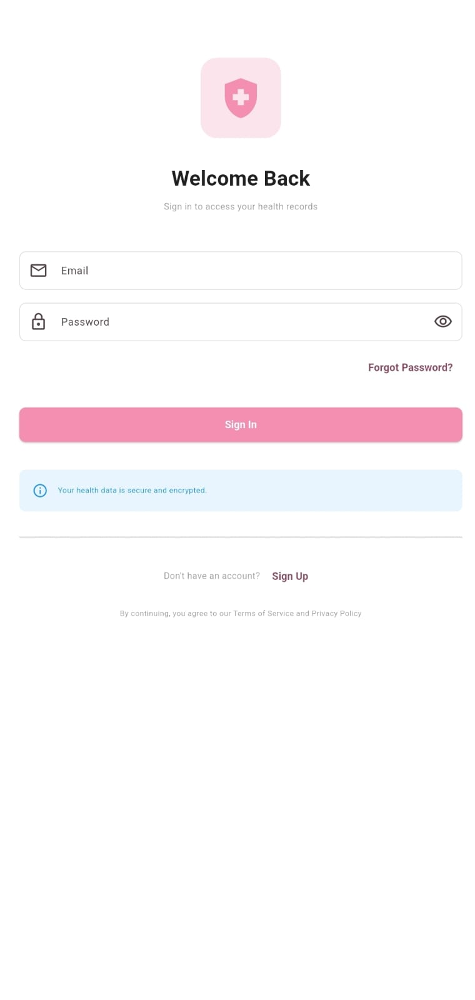

Mothers and healthcare providers can securely access their health records with email and password authentication.

### Create Account
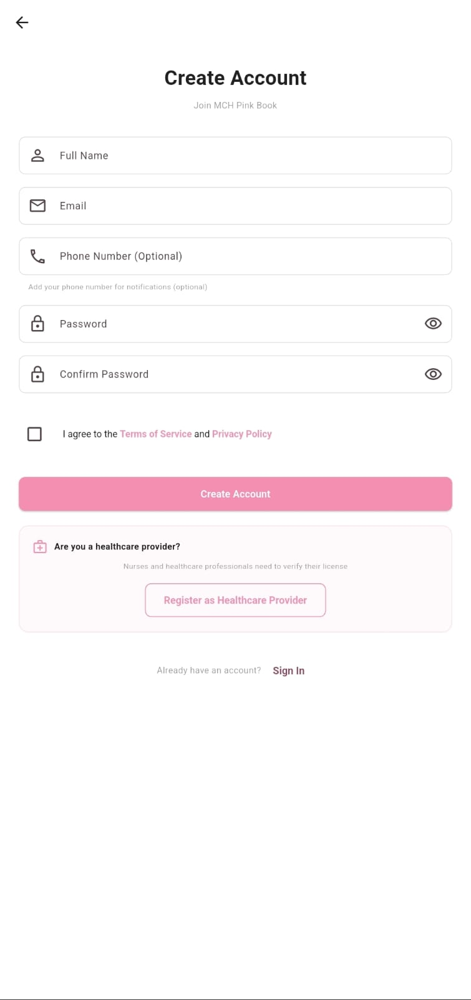

New users can register with:
- Full Name
- Email
- Phone Number (Optional)
- Password
- Healthcare providers can register separately to verify their license

---

## 👩‍⚕️ Nurse Dashboard
**Comprehensive MCH Clinical Dashboard**

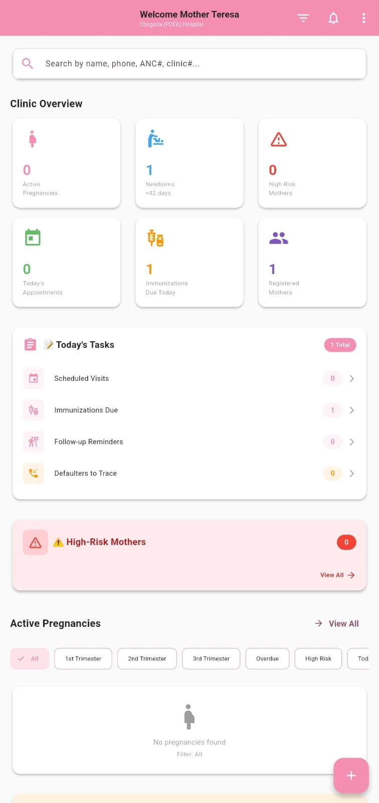

The **NurseHomeScreen** provides real-time clinic insights, patient management tools, and ANC/KMC follow-up workflows.

### Key Features

#### ✅ AppBar
- Display authenticated nurse + clinic details
- MFL Code or Clinic Name
- Quick actions:
  - Filters
  - Notifications
  - Sync Status
  - Logout

#### 🔍 Search Bar
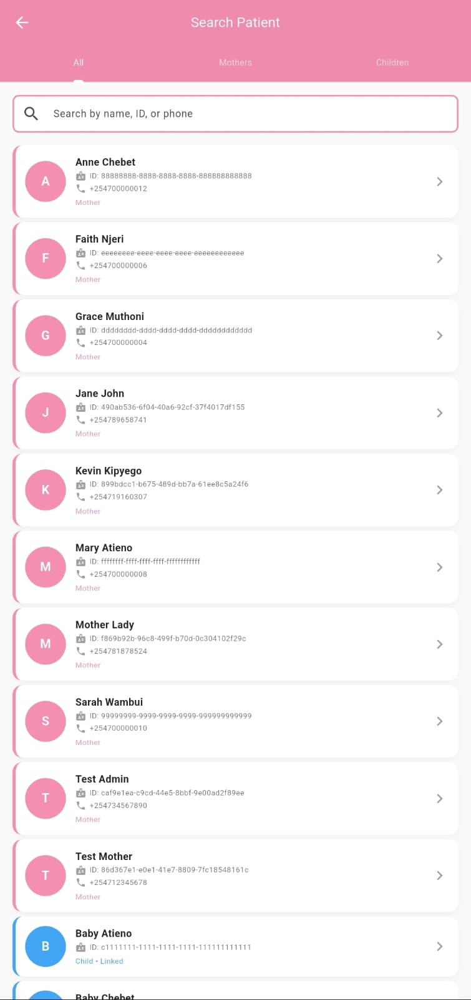

Allows nurses to quickly search for mothers, pregnancies, appointments, or children by:
- Name
- ID
- Phone number

#### 📊 Dashboard Sections

**Clinic Statistics**  
Displays aggregated:
- ANC visits
- Deliveries
- Children services
- Growth monitoring
- Immunization stats

**Today's Tasks**  
Shows actionable items for the day:
- Scheduled ANC visits
- Immunization tasks
- Follow-up reminders

**High-Risk Alerts**  
Identifies:
- High-risk pregnancies
- Mothers with complications
- Critical alerts requiring immediate attention

**Active Pregnancies**  
Filterable by:
- All
- High Risk
- Upcoming
- Overdue  

Uses Riverpod with dynamic filtering.

**Defaulters**  
Mothers who missed:
- ANC visits
- Growth monitoring
- Immunization

**Immunization Tracker**  
Shows:
- Immunizations due today
- Overdue vaccines
- Next scheduled dose

#### ⚡ Quick Action Floating Button
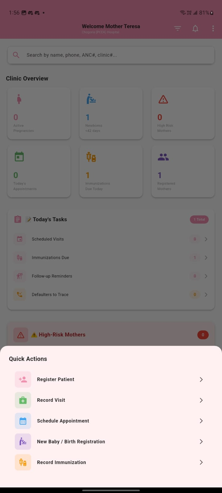

Shortcuts for:
- **Register Patient** – Add new mothers
- **Record Visit** – Document clinic visits
- **Schedule Appointment** – Book future visits
- **New Baby / Birth Registration** – Register newborns
- **Record Immunization** – Log vaccine doses

#### 📅 Appointments Management
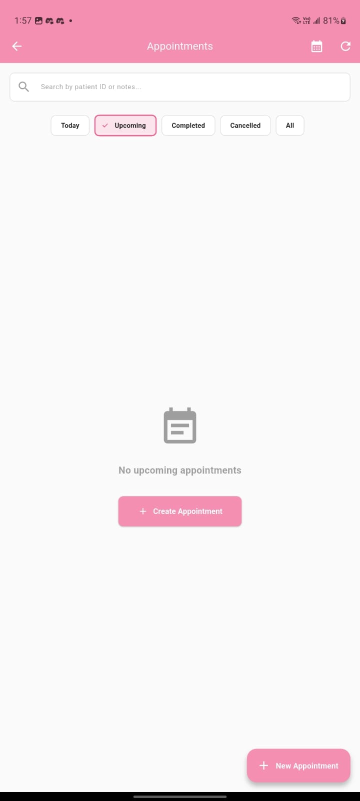

- View appointments by status: Today, Upcoming, Completed, Cancelled, All
- Search by patient ID or notes
- Create new appointments
- Track scheduled visits

#### 👤 Patient Registration
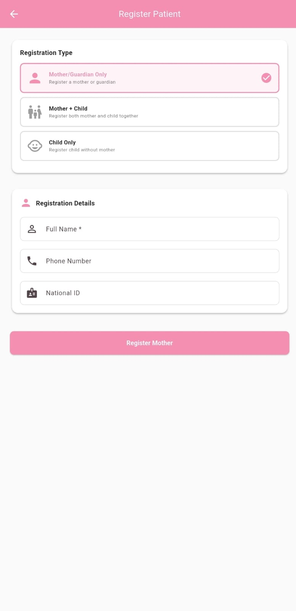

Registration options:
- Mother/Guardian Only
- Mother + Child
- Child Only

Required details:
- Full Name
- Phone Number
- National ID

#### 🔄 Full Data Refresh
Pull-to-refresh reloads all:
- Stats
- Pregnancies
- Alerts
- Defaulters
- Tasks
- Immunization summaries
- Appointments

---

## 🤱 Mother Dashboard
**Personal Pregnancy & Child Health Home Screen**

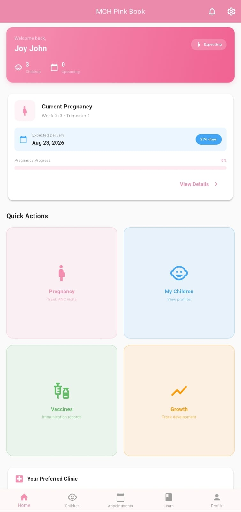

The **MotherHomeScreen** helps mothers track appointments, pregnancy progress, and children's health.

### Features

#### 🧭 AppBar
- App title
- Settings
- Notifications

#### 👋 Welcome Card
Shows:
- Mother's name
- Number of children
- Count of upcoming appointments
- "Expecting" pregnancy badge (if active pregnancy exists)

#### 🧩 Profile Completion Prompt
Appears when setup is incomplete:
- Encourages mother to complete profile
- Navigates to profile screen

#### 🤰 Pregnancy Card
If the mother is pregnant:
- Current week and trimester
- Expected delivery date
- Days remaining countdown
- Pregnancy progress bar
- Quick access to pregnancy journey
- ANC visit tracking

#### 🎯 Quick Actions
Grid shortcuts including:
- **Pregnancy** – Track ANC visits
- **My Children** – View profiles
- **Vaccines** – Immunization records
- **Growth** – Track development

#### 🏥 Preferred Clinic
Shows:
- Selected clinic
- Last visit
- Tap to view more (coming soon)

#### 👶 My Children Section
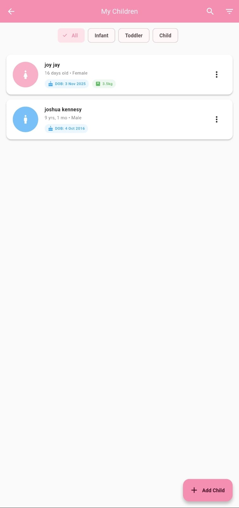

Displays:
- Child count
- Quick preview with:
  - Name
  - Age
  - Gender
  - Date of birth
  - Weight (for infants)
- Filter by: All, Infant, Toddler, Child
- "Add Child" action button

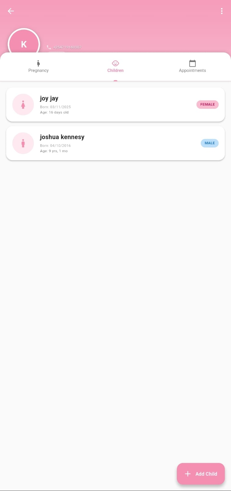

Detailed view showing:
- Child avatar
- Basic information
- Tabs for Pregnancy, Children, and Appointments

#### 💉 Immunization Card
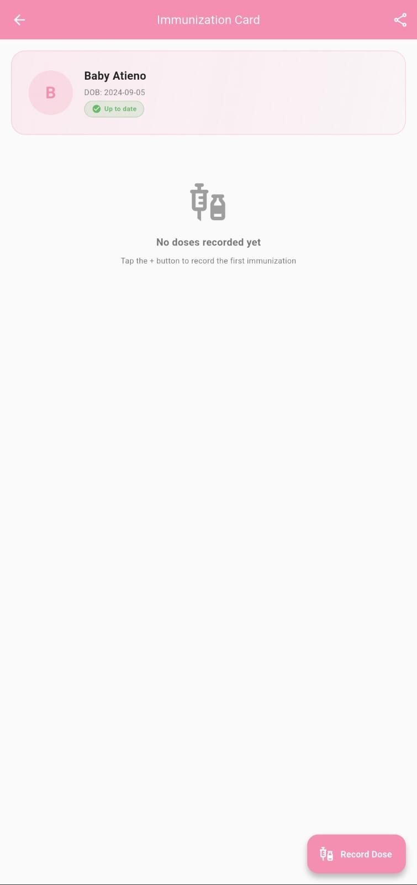

For each child:
- Immunization status badge (Up to date / Overdue)
- Date of birth
- Record immunization doses
- Track vaccination schedule

#### 📅 Upcoming Appointments
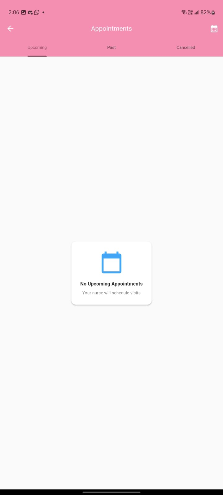

Real data fetched from `upcomingAppointmentsProvider`

Features:
- View by status: Upcoming, Past, Cancelled
- Next appointments
- Card layout with date, type, clinic
- Calendar integration
- Nurse-scheduled visits notification

#### 💡 Health Tips
Useful guidance on:
- Breastfeeding
- Nutrition
- Hygiene
- Infant care

#### ⬇️ Bottom Navigation
Tabs:
- **Home** – Dashboard overview
- **Children** – Child profiles
- **Appointments** – Visit schedule
- **Learn** – Health education
- **Profile** – Personal settings

---

## 🏗 Technical Summary

### Architecture
- **Flutter** – Cross-platform mobile framework
- **Riverpod State Management** – Reactive state handling
- **Domain-driven separation** – Clean architecture principles
- **Clean Providers + Entities** – Separation of concerns
- **Modular UI Widgets** – Reusable components
- **Centralized App Constants & Typography** – Consistent design system

### Key Providers Used
- `authNotifierProvider`
- `clinicStatsProvider`
- `activePregnanciesProvider`
- `highRiskMothersProvider`
- `currentPregnancyProvider`
- `upcomingAppointmentsProvider`

### Important Helpers
- DialogHelpers
- Navigation Helpers
- Search functionality
- FAB Quick Actions

### 🔄 Refresh Behavior
- **Nurses** → refreshes all clinical data
- **Mothers** → refreshes user data + pregnancy + appointments

All screens use: `RefreshIndicator()`

---

## 🚀 How to Run

1. Install dependencies:
   ```bash
   flutter pub get
   ```

2. Run app:
   ```bash
   flutter run
   ```

---

## ❤️ Contributors

**MCH Pink Book Digital Health Team**  
Ministry of Health + Supporting Partners